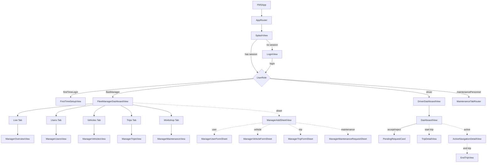
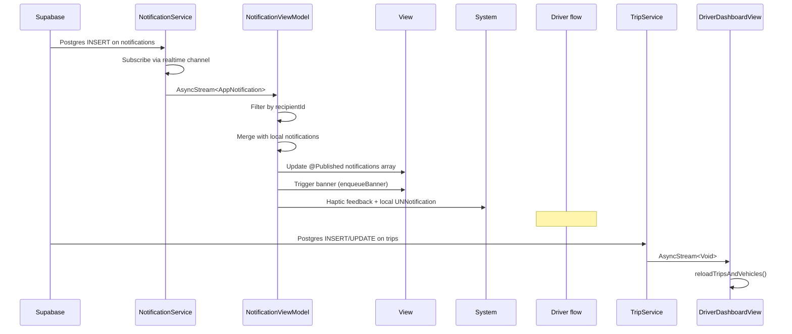
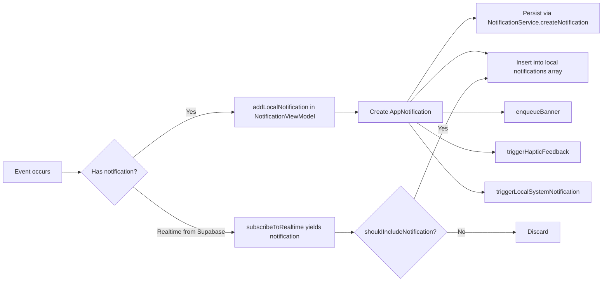

# Architecture Document

## Folder Structure

```
FMS/                                  # Xcode project root
├── Database/                         # SQL migrations and seeds
│   ├── migrations/                   # Timestamped DDL migrations (22 files)
│   ├── seeds/                        # Demo data seeds (8 files)
│   └── verify_fleet_seed.sql         # Seed verification script
├── FMS/
│   ├── App/                          # App entry point and root router
│   │   ├── FMSApp.swift              # @main entry, AppDelegate, UNNotifications
│   │   └── AppRouter.swift           # Root routing, AppServices DI container
│   ├── Core/
│   │   ├── Enums/                    # VehicleStatus, TripStatus, MaintenanceTaskStatus, etc.
│   │   ├── Extensions/               # Color+Extensions, Date+Extensions, UUID+Extensions
│   │   ├── Infrastructure/           # SupabaseService, EnvironmentConfig, SharedDecoder, etc.
│   │   ├── Models/                   # 20+ Codable model structs
│   │   ├── ViewModels/               # NotificationViewModel (shared)
│   │   └── Views/                    # NotificationBadge, NotificationListView, NotificationBannerView
│   ├── Services/                     # Supabase-backed actor services
│   │   └── Protocols/                # Service protocol interfaces
│   ├── Modules/
│   │   ├── Auth/                     # Login, signup, password reset, first-time setup
│   │   ├── Driver/                   # Driver dashboard, trips, inspections, fuel, SOS, profile
│   │   └── FleetManager/             # Dashboard, users, vehicles, trips, maintenance, reports
│   │   └── Maintenance/NewUI/        # Self-contained maintenance personnel module
│   ├── Resources/                    # Shared UI components, theme, assets
│   └── EdgeFunctions/                # Supabase Edge Functions (2 of 5 exist in repo)
├── FMSTests/                         # Unit test target (template only)
├── FMSUITests/                       # UI test target (template only)
├── Secrets.debug.xcconfig            # Developer credentials (COMMITTED — security risk)
└── Secrets.release.xcconfig          # Release credentials (COMMITTED — security risk)
```

## Responsibility of Every Major Folder

| Folder | Responsibility |
|--------|---------------|
| `App/` | Application entry point, root navigation, dependency injection container |
| `Core/Enums/` | Domain enums shared across all modules (5 files) |
| `Core/Extensions/` | Global extensions on Foundation/SwiftUI types |
| `Core/Infrastructure/` | Supabase client setup, JSON coding, config, shared utilities |
| `Core/Models/` | Domain model structs (Codable, 1:1 with DB tables) |
| `Core/ViewModels/` | Shared view models (NotificationViewModel used by all roles) |
| `Core/Views/` | Shared notification views |
| `Services/` | App-wide actor service implementations for all Supabase CRUD |
| `Services/Protocols/` | Protocol definitions for all services |
| `Modules/Auth/` | Authentication flows: login, signup, password reset, first-time setup |
| `Modules/Driver/` | Driver role: dashboard, trip flow, inspections, fuel, incidents, profile |
| `Modules/FleetManager/` | Fleet Manager role: dashboard, users, vehicles, trips, maintenance, reports |
| `Modules/Maintenance/NewUI/` | Maintenance Personnel: independent UI system with own services, DI, navigation |
| `Resources/` | Shared theme (colors, typography), reusable SwiftUI components |
| `EdgeFunctions/` | Supabase Edge Function source code (send-recovery-otp, send-password-reset) |

## Module Relationships

```
App (FMSApp → AppRouter)
  │
  ├── AppServices (DI container)
  │    ├── SupabaseService (shared client)
  │    ├── AuthService
  │    ├── VehicleService
  │    ├── TripService
  │    ├── MaintenanceService
  │    ├── InventoryService
  │    ├── UserManagementService
  │    ├── FleetNotificationService
  │    ├── NotificationService
  │    ├── InspectionService
  │    ├── ExpenseService
  │    └── WorkOrderAssignmentService
  │
  ├── Auth Module (LoginView, ForgotPasswordView, etc.)
  ├── FleetManager Module
  │    ├── FleetManagerDashboardView (TabView + NavigationStack)
  │    ├── ViewModels: VehicleViewModel, TripManagementViewModel, UserManagementViewModel,
  │    │              MaintenanceViewModel, ReportsViewModel, ManagerNotificationController
  │    └── Views: Users, Vehicles, Trips, Maintenance, Reports (hub + 6 detail views)
  │
  ├── Driver Module
  │    ├── DriverDashboardView → DashboardView
  │    ├── LocationManager (ObservableObject, served via @EnvironmentObject)
  │    └── Features: Trips, Vehicle/Inspections, Fuel, Emergency, Performance, Profile
  │
  └── Maintenance/NewUI (self-contained)
       ├── MaintenanceTabRouter → RootTabView
       ├── AppDependencyContainer (own DI)
       ├── Own services: SupabaseVehicleService, SupabaseWorkOrderService, etc.
       ├── Own navigation: NavigationCoordinator, AppRoute, RouteViewFactory
       ├── Own theme: AppColor, AppTypography, AppSpacing, etc.
       └── Own components: WorkOrderCard, VehicleCard, SummaryCard, etc.
```

## MVVM Relationships

### Fleet Manager
```
View (FleetManagerDashboardView) ──@StateObject──→ ViewModel (TripManagementViewModel)
  │                                                    │
  │  @StateObject                                      │ protocol
  │  TripManagementViewModel                           ▼
  │  VehicleViewModel                            Service Actor
  │  UserManagementViewModel                     (TripServiceProtocol)
  │  MaintenanceViewModel
  │  NotificationViewModel
  │
  ├── ManagerTripFormSheet      ─→ TripManagementViewModel.createTrip()
  ├── ManagerVehiclesView       ─→ VehicleViewModel
  ├── ManagerUsersView          ─→ UserManagementViewModel
  ├── ManagerMaintenanceView    ─→ MaintenanceViewModel
  └── ReportsHubView            ─→ ReportsViewModel (references all other VMs)
```

### Driver
```
DriverDashboardView ──loads data──→ DashboardView (receives trips, vehicles, driver)
  │                                     │
  │ @EnvironmentObject                   │ EnvironmentObject
  │ LocationManager                      │ LocalDataStore.shared
  │                                      │
  ├── ActiveNavigationDetailView  ──→ LocationManager.startTracking()
  ├── EndTripView                 ──→ LocationManager.stopTracking(), InspectionViewModel
  ├── InspectionView              ──→ InspectionViewModel, InspectionService
  ├── FuelHistoryView             ──→ ExpenseService
  ├── DashboardView               ──→ TripService (accept/reject trip)
  └── TripDetailView              ──→ TripService
```

### Maintenance Personnel (NewUI)
```
MaintenanceTabRouter → RootTabView
  │
  ├── NavigationCoordinator (ObservableObject)
  │    ├── selectedTab: AppTab
  │    ├── dashboard: TabNavigationState
  │    └── myJobs: TabNavigationState
  │
  ├── AppDependencyContainer (DI)
  │    ├── vehicleService: VehicleServicing
  │    ├── workOrderService: WorkOrderServicing
  │    ├── activityService: ActivityServicing
  │    ├── authService: AuthServicing
  │    └── notificationService: NotificationServicing
  │
  └── RouteViewFactory (AppRoute → View mapping)
```

## Data Flow Diagram (Mermaid)

```mermaid
graph TD
    A[Info.plist] -->|SUPABASE_URL/KEY| B[EnvironmentConfig]
    B --> C[SupabaseService]
    C -->|SupabaseClient| D[Service Actor]
    D -->|client.from.table.select| E[(Supabase DB)]
    E -->|Decoded JSON| F[SharedDecoder]
    F -->|Codable Model| G[ViewModel]
    G -->|@Published| H[SwiftUI View]
    
    I[Edge Function] -.->|URLSession| D
    J[Supabase Realtime] -.->|AsyncStream| G
```

## Navigation Diagram (Mermaid)



## Realtime Flow (Mermaid)



## Notification Flow (Mermaid)


